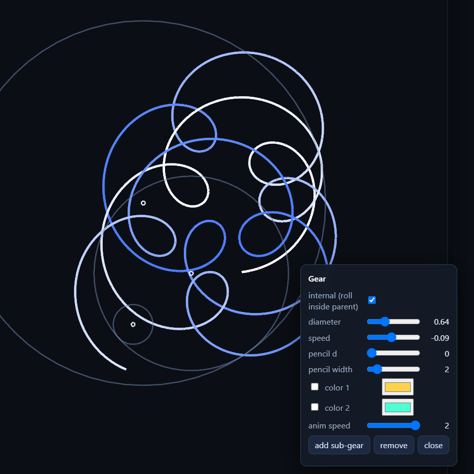

# interactive [spirograph](https://en.wikipedia.org/wiki/Spirograph) (WebGL2)

draw hypotrochoid / epitrochoid curves in the browser. no build step.

## features summary

	interactive parent-child gear tree, add / remove sub-gears
	gear tree level sliders (lvl 1..N, starting at 0): every parent at a depth
	  gets N children placed at i*360/N degrees; 0 removes the level and
	  everything below it; new siblings deep-clone the template sub-tree;
	  `reset levels` collapses the tree to a single chain
	symmetry mode: context-menu edits mirror to every gear at the same level;
	  add-sub-gear grows the whole level
	per-gear: internal/external, speed -1..1, diameter, pencil offset d, width,
	  two color slots (each with its own enable checkbox) -> 0 colors = no pencil,
	  1 color = static, 2 colors = animated blend between them
	  global cycles/frequency color mode (auto per trace mode, user-overridable)
	per-pencil trail length (how much of the animate trail stays on screen;
	  rings grow lazily) + a separate whole-mode `detail` (points per turn)
	whole-curve mode with tolerance-based period detection, background
	  (time-sliced) baking with a progress readout, and sliders that only stop
	  on period-friendly values; `max period` sets the search ceiling
	zoom / pan, pause, clear, reset to default scene
	save scene as a .js file (rename to default.js for startup scene) / load
	  .js or legacy .json (file or clipboard), autosave to localStorage
	60+ FPS pan/zoom in both modes: direct-draw during gestures, one overlay
	  re-bake on release, auto-tuned decimation on weak GPUs
	zero dependencies, WebGL2, runs from file://

### run

no build. run with double click in file explorer.

file:// friendly. no server need. load js script tags, not ES modules.

for node debugging, guard module.exports so the same files run in both.

## layout

square canvas, size = short side of window (snapped to mod 64px texture)

GUI sits left for wide windows, top for tall windows

zoom / pan with pointer, touch and mouse wheel

default scene: main gear is 60% of canvas, pivot fixed at center

GUI has a global animation speed slider

## model

gears form a parent-child tree

	main gear = root, pivot fixed in place
	each child gear attached to parent, rotates around it pivot
	each gear has: radius (size vs parent), speed -1..1, optional pencil at offset d

curve = path traced by an enabled pencil over time

classic params: R fixed, r rolling, d pen offset -> hypotrochoid / epitrochoid

### math

parametric curve, θ = rotation angle of rolling gear:

	hypotrochoid (inside):
		x = (R - r) cos θ + d cos(((R - r)/r) θ)
		y = (R - r) sin θ - d sin(((R - r)/r) θ)
	epitrochoid (outside):
		x = (R + r) cos θ - d cos(((R + r)/r) θ)
		y = (R + r) sin θ - d sin(((R + r)/r) θ)

in this app R,r come from each gear radius vs its ancestor chain; internal/external picks the sign.

### use case

mouse L and mouse center btn - pan. right mouse btn keep native browser behavior to be possible save image, etc.
mouse left btn on gear - show context menu.

from this menu user can:

	switch is this gear internal or external relative to parent
	sliders: gear diameter and rotation speed -1...1
	move slider of marker pencil position (distance from center of this gear)
	slider of pencil line width
	slider of trail length (how many points of the animate trail stay on
	screen; hidden in whole mode, where the curve is the whole closed figure
	and its smoothness is the sidebar `detail` slider)
	two color slots, each with its own enable checkbox placed before the picker:
		if none enabled  -> no pencil is drawn
		if one enabled    -> static single color
		if both enabled   -> animated blend between the two colors (speed slider)
	place sub-gear
	remove this gear (and its children)

the left panel has a `tree` section:

	symmetry mode checkbox - when on, every context-menu edit above applies
	to all sibling gears at the same level (added/removed in sync)
	lvl 1..N sliders - set how many children every parent at that depth has;
	children are positioned evenly around their parent (i * 360/N degrees).
	the slider range starts at 0: dragging a level to 0 empties it (and every
	level below it), which is how a level is removed. lvl k+1 appears once
	level k has sub-gears; a 400-gear guard blocks a runaway 12 x 12 x 12.
	reset levels button - collapse every level to a single child

and a `whole mode` section (visible in whole mode):

	period readout - `period: 132 turns` (or `~132 turns (approx, gap ...)`
	when nothing closes exactly), plus `- baking NN%` while the background
	bake runs
	max period slider (4..4000) - the CEILING of the closure search, not a
	target. the readout shows the smallest turn count that closes the figure,
	which on the whole-mode gear grid is usually 30..200; lower the ceiling to
	cut a long figure short (drawn, marked ~approx), raise it to let a long
	one close.
	detail slider (20..2000 points per turn) - smoothness of the baked curve
	(period x detail points, capped at 40000 per pencil)

drag context menu using pointer. move by drag caption 'gear' label with unicode ico ✥ near it

middle mouse pan

### simulation

every frame

	gears rotate according speed, properly calculate position and rotation with parent and child gears.
	enabled pencils draw smooth line from last to current position

### render

smooth antialiased lines

draw modes:

* animated draw similar to pencil using last N segments or FBO draw

* calculate whole line and update interactively while move sliders. properly detect period and improve sliders to fit periods

	period detection is a closure scan, not an exact LCM: the figure is a sum
	of rotating vectors, and the app looks for the smallest number of turns `u`
	where every harmonic `f` satisfies `|frac(f*u)| * 2pi * amplitude <= ~0.5px`.
	that is continuous in the parameters (a hair-thin diameter change no longer
	multiplies the period by 100), bounded in cost, and always answers: if
	nothing closes within `max period`, the best candidate is drawn and the
	readout marks it `~N turns (approx)`.

	the bake itself is a resumable job stepped from the frame loop in ~6ms
	slices, so the UI never freezes and the figure appears progressively.
	while a slider is dragged a quarter-resolution draft is baked and refined
	once the drag stops.

	in this mode `speed` and `diameter` are index sliders over the discrete set
	of values that keep the period short (speed = +-k/d with d <= 12, diameter =
	a rational multiple of the parent diameter), so every reachable position is
	a valid one.

* without circles but only 'dial' lines from center. look how it draw it - it visually good looks

* only glowing pencil points (no traces, no center of gears)

change (animate) pencil color hue. not blend all but:
example
color 1 = Y
color 2 = R
animation should be Y...G...B...R
light and saturation just blend

#### properly change color of pencil:
for r,b
r-g-b-g-r-r-g-b-g-...
for b,r 
b-r-b-r-...
color1-color2 is not same as color2-color1. and it should not do whole hue wheel 

### dependencies

WebGL2, no framework

no internet links in code. if need any lib to run - download it and link as js file. 

### requirements

modern browser with WebGL2 support

### controls
	space - pause / resume
	wheel or gesture - zoom
	drag - pan
	click / hover gear axis - context menu
	Esc - close context menu (also auto-closes)

	GUI buttons, also keyboard shortcuts:
	c - clear canvas
	x - reset objects to default scene + view transform
	s - copy scene model (gears, view) json to clipboard
	d - download scene model as .js file (rename to default.js for startup scene)
	o - load scene model from file (.js or legacy .json)
	p - load scene model from clipboard
### state

on exit save to localStorage, restored on load. 
if localStorage failed - should be 'autosave unavailable' label near save buttons in GUI 

### scene format

scene saved/loaded by s / d / o / p: clipboard uses json; the file format (d)
wraps the same object in a SETTINGS js module so a saved scene can be renamed to
`default.js` and become the startup scene. legacy .json files still load.
colors are hex strings, parsed to rgb floats internally for webgl, example:

	{
	  "gears": [ { "r": 0.6, "speed": 0.2, "internal": false,
	               "phase0": 0, "rot": 0, "trailCap": 20000,
	               "pencil": { "d": 0.4, "width": 2,
	                           "c1": { "on": true, "color": "#ff0000" },
	                           "c2": { "on": false, "color": "#0000ff" },
	                           "animSpeed": 0.1 },
	               "children": [] } ],
	  "view": { "zoom": 1, "pan": [0, 0] },
	  "globalSpeed": 1,
	  "colorMode": "frequency"
	}

`phase0` (constant mount offset of the gear around its parent, radians - what
the level sliders use to build a rosette), `rot` (live orbit angle) and
`trailCap` (soft cap on stored trail points) are optional; legacy files
without them default to 0 / 0 / 20000. the `app` block additionally carries
`maxPeriod` (legacy files may carry the old `periodThreshold`, which maps
onto it).

### structure

	README.md - this file
	AGENTS.md - guidance for LLM agents
	index.html - entry point (classic <script> tags, no build)
	default.js - startup scene (SETTINGS module; replace to change the default)
	implementation-log.txt - what is already done and next step for LLM agents
	findings-pitfalls-skills.md - notes for LLM agents
	CHANGELOG.md - short release notes
	03-performance-refactoring-plan.md - pan/zoom perf plan (implemented)
	04-plan-level-sliders-symmetry.md - level sliders + symmetry plan (implemented)
	06-review-branch-comparison.md - review of the two 04-plan implementations
	05-plan-3D.md - 3D mode plan (next)
	js/main.js - init, loop
	js/gear.js - gear math
	js/render.js - webgl2 line drawing (shaders, buffers, MSAA)
	js/gui.js - context menu, sliders
	test/run.js - headless checks: `node test/run.js`
	test/preview.js - offline PNG render of a bake: `node test/preview.js out.png`

### license

MIT
